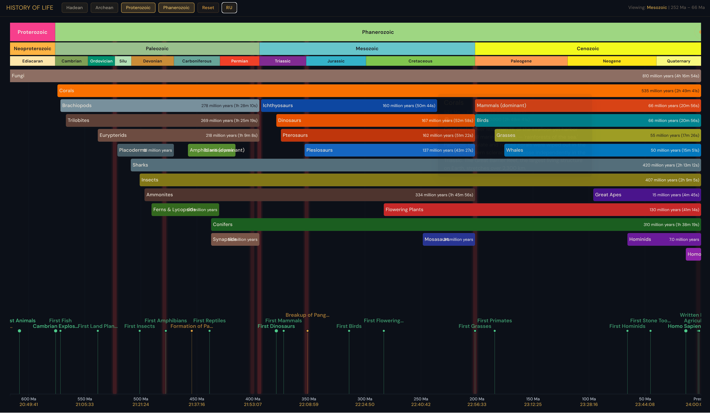

# DeepTime 🌍

**DeepTime** is a high-performance interactive visualization of 4.54 billion years of Earth's history. The project combines geological data, key biological events, and species life spans into a single intuitive timeline.

[**Live Demo**](https://vlmihnevich.github.io/DeepTime/)

## 🌟 Features

- **Deep Time:** Visualization of the entire history of the planet from the Hadean eon to the present day.
- **Non-linear scale:** Using a power scale (`d3.scalePow().exponent(0.5)`) gives more visual space to recent events without cutting off ancient history.
- **Interactivity:** Smooth zoom and pan (D3 Zoom), allowing transitions from a scale of billions of years to specific millennia.
- **"Earth Clock" Mode:** A built-in metaphor that translates millions of years into a familiar 24-hour format (e.g., humans appearing in the final minutes of the day).
- **Multi-layered:** Separate layers for eons, eras, periods, extinctions, and evolutionary branches.
- **Bilingual:** Full support for Russian and English (i18n).

## 🏗 Architecture and Technologies

The project is built on the principles of minimalism and maximum performance:

- **D3.js & TypeScript:** Direct DOM and SVG management without heavy frameworks.
- **Component-based approach:** Each element (Events, SpeciesBars, GeoLayer) is an independent class with a `render(ctx)` method, optimized for frequent updates during zooming.
- **Smart Lane Packing:** The algorithm in `src/utils/geology.ts` automatically distributes species across "lanes" to prevent overlap.
- **Single File Build:** Thanks to `vite-plugin-singlefile`, the entire project is bundled into a single standalone HTML file, easy to share or host.

## 🚀 Commands

The project uses Vite for building and development:

- `npm run dev` — start the development server with HMR (Hot Module Replacement).
- `npm run build` — type check via `tsc` and build to `dist/index.html`.
- `npm run preview` — local preview of the production build.

## 📦 Deployment (GitHub Pages)

The project is configured for automatic deployment via GitHub Actions.

To enable deployment:
1. Push your changes to the `main` branch.
2. Go to your GitHub repository **Settings** > **Pages**.
3. Under **Build and deployment** > **Source**, select **GitHub Actions**.
4. The site will be automatically built and deployed whenever you push to `main`.

Manual deployment:
- Run `npm run build`.
- The single-file build will be in `dist/index.html`. You can manually upload this file to any static hosting.

## 🛠 Data

All data is stored in JSON format in `src/data/`:
- `geological.json`: Hierarchy of periods.
- `events.json`: Key markers (emergence of water, great oxidation event, etc.).
- `species.json`: Time intervals of existence for groups of organisms.

---
*The project was created as an educational tool for a visual understanding of the scale of evolution.*
